# Keycloak Benchmarking Guide

This guide facilitates the benchmarking of Keycloak through a Python Flask application integrated with Keycloak through OpenID Connect (OIDC). The setup is inspired by Thomas Darimont's example, accessible [here](https://gist.github.com/thomasdarimont/145dc9aa857b831ff2eff221b79d179a).

## Overview

- [Results](#results)
- [Components](#components)
- [Set Up Keycloak](#set-up-keycloak)
- [Set Up Python Flask App](#set-up-python-flask-app)
- [Measure the Performance of Keycloak](#measure-the-performance-of-keycloak)

## Results

A full research paper on the results of this benchmarking can be found [here](https://docs.google.com/document/d/1qLqGcEsFkt1jJtgtSx0J0UAFOgM4F36P2qjfi0IVykw/edit?usp=sharing). For the raw results of the benchmarking, see the [results](results) directory.

### Fetch time comparison

The chart below displays the average fetch time in seconds per number of groups. Notably, Keycloak 22.0.5 outperforms 23.0.0, even though Keycloak claims the following in the 23.0.0 release notes: “Performance around searching of groups is improved for the use-cases with many groups and subgroups. There are improvements, which allow paginated lookup of subgroups.” (Source: [Keycloak 23.0.0 Release Notes](https://www.keycloak.org/docs/latest/release_notes/index.html#group-scalability))

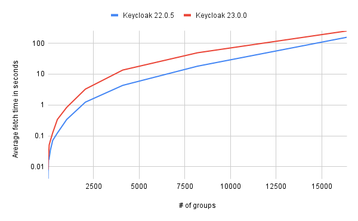

### Percentage differences

The chart below illustrates the percentage differences in speed between Keycloak versions 23.0.0 and 22.0.5. Note the inconsistent pattern, as the performance decline exceeds 100% for group sizes ranging from 512 to 8192, followed by a relative improvement with 16384 groups being around 60% slower.

## Components

- **flask-app**: Python Flask application
- **keycloak**: Keycloak installed in a Docker container
- **keycloak-fill-db-scripts**: Go scripts to populate the Keycloak database

## Set Up Keycloak

### 1. Launch Keycloak

```bash
docker run -p 8080:8080 -e KEYCLOAK_ADMIN=admin -e KEYCLOAK_ADMIN_PASSWORD=admin quay.io/keycloak/keycloak:23.0.0 start-dev
```

- Note: Login credentials are set to `admin:admin`.
- Keycloak is now running at [http://localhost:8080](http://localhost:8080).

### 2. Create a Realm

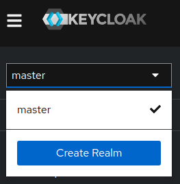

Call the realm `benchmarking`, or any other name you prefer.

### 3. Create a Client

#### General Settings

- Client ID: `flask-app`
  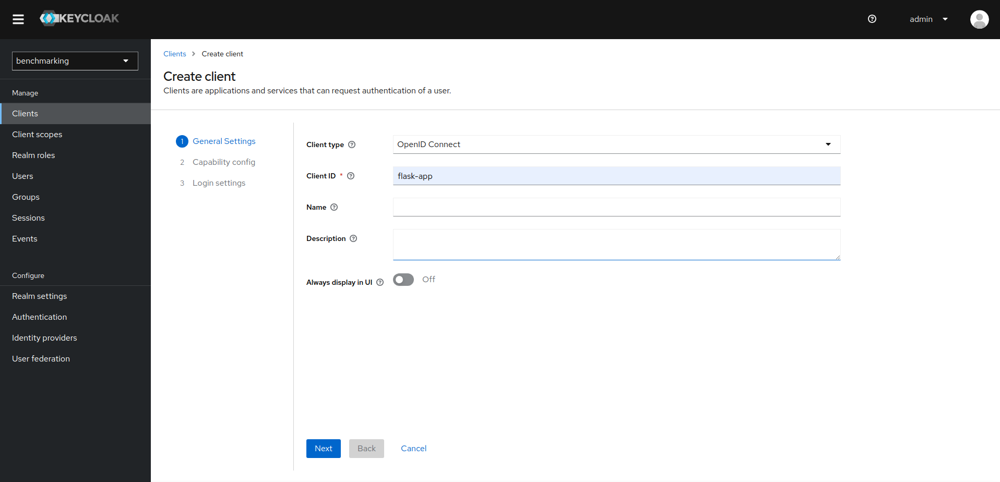

#### Capability Config

- Client authentication: `On`
  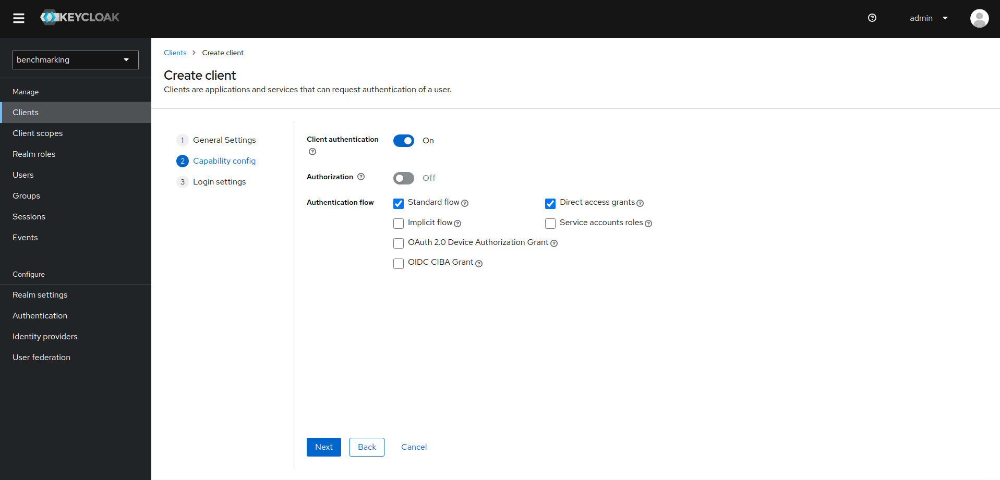

#### Login Settings

- Valid redirect URIs: `http://localhost:5000/*`
  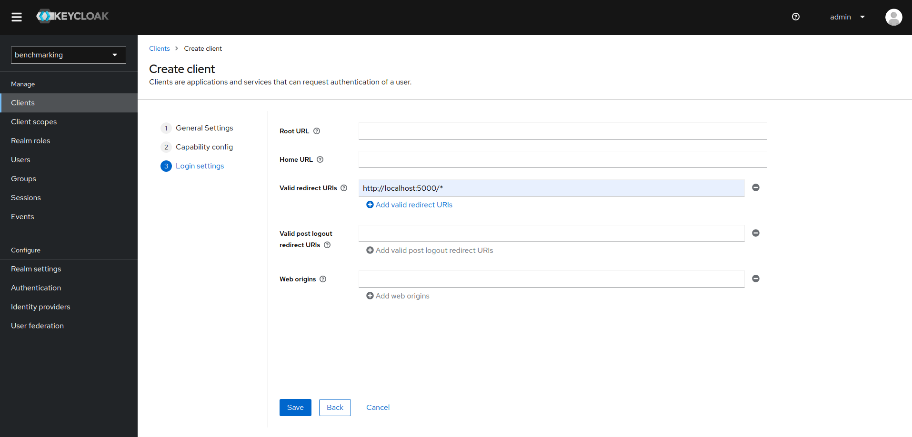

#### Copy Client Secret to Flask App

Copy the client secret from the client details page and paste it into the `client_secrets.json` file in the `flask-app` directory.
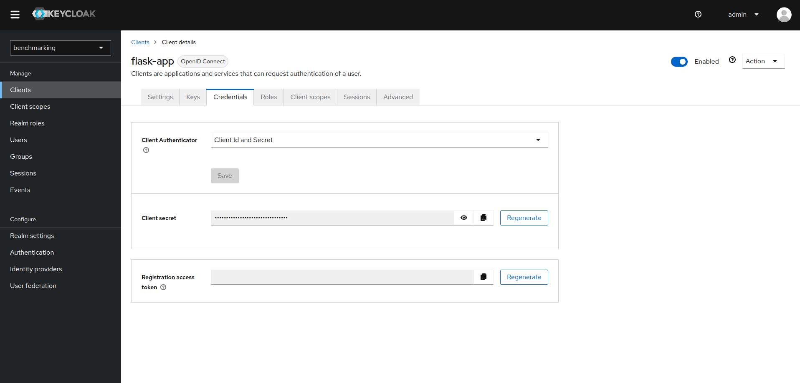

### 4. Adjust Token Lifetimes

By default the access token lifespan is set to 1 minute and the SSO session idle timeout is set to 30 minutes. Make sure you change these settings in the `master` realm. To increase the token lifetimes, follow these steps:

- Set the SSO session idle timeout to 1 day:
  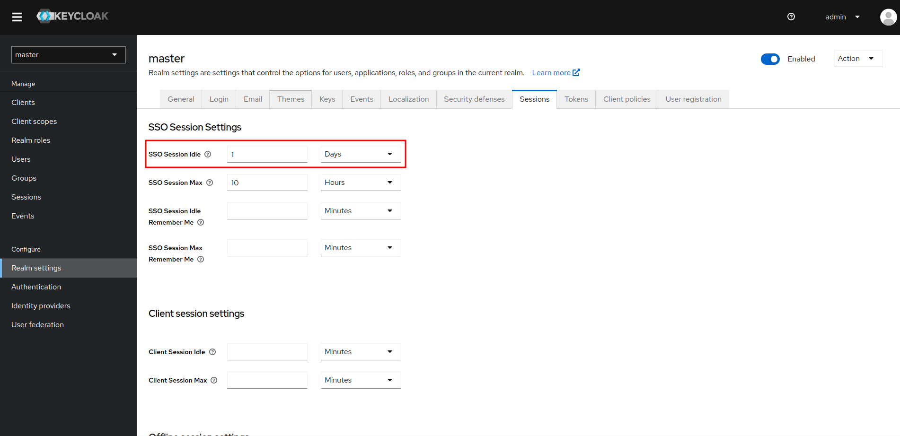

- Set the access token lifespan to 1 day:
  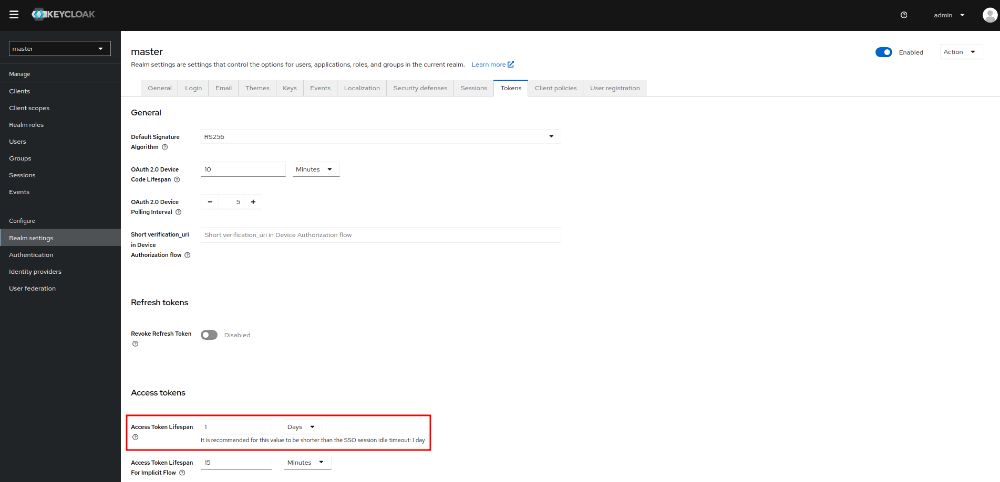

### 5. Create a User

- Username: `user`
- Email: `user@example.org`
- Email Verified: `Yes`
- First Name: `user`
- Last Name: `user`

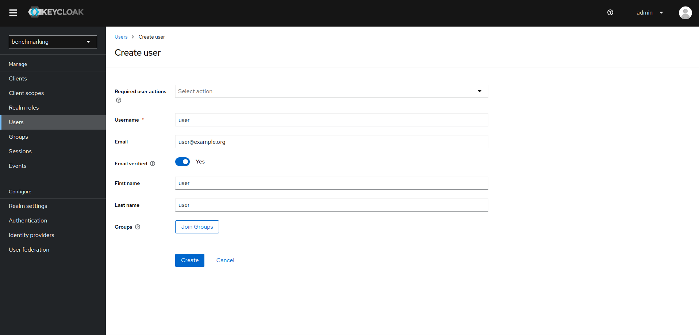

#### Set User Password

- Make sure to turn off the `Temporary` switch before saving the password.

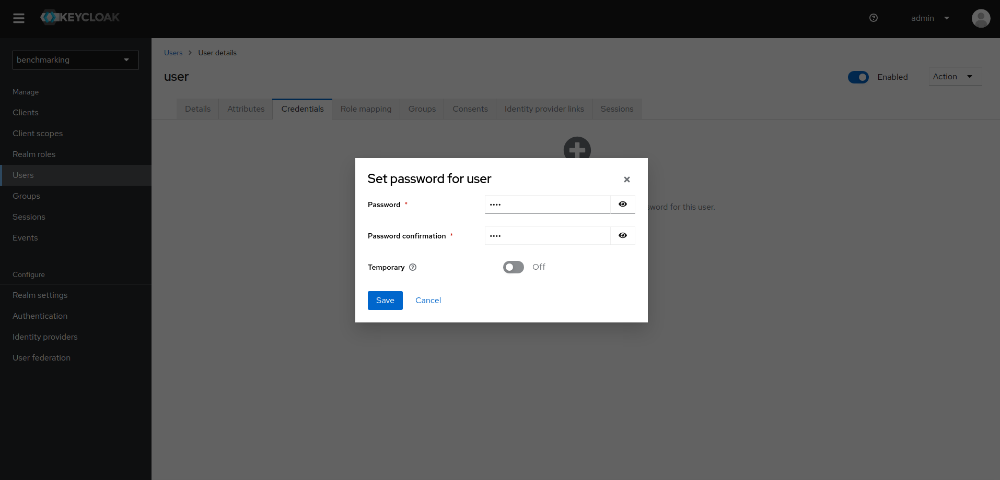

## Set Up Python Flask App

### 1. Create a Virtual Environment

```bash
mkvirtualenv keycloak-benchmarking
```

### 2. Install Dependencies

```bash
pip install flask flask_oidc
```

### 3. Run the Application

```bash
cd flask-app
python app.py
```

The Python Flask app is now running at [http://localhost:5000](http://localhost:5000).

## Measure the Performance of Keycloak

### 1. Retrieve Admin User Access Token

```bash
curl -X POST \
  'http://localhost:8080/realms/master/protocol/openid-connect/token' \
  --header 'Accept: */*' \
  --header 'Content-Type: application/x-www-form-urlencoded' \
  --data-urlencode 'username=admin' \
  --data-urlencode 'password=admin' \
  --data-urlencode 'grant_type=password' \
  --data-urlencode 'client_id=admin-cli'
```

### 2. Install Go Modules

```bash
cd keycloak-fill-db-scripts
go get 
```

### 3. Execute Go Scripts

#### Creating groups

Adjust the configurations in `cmd/create_groups/main.go`:

```go
const (
    baseUrl     = "http://localhost:8080"
    realm       = "your_realm"
    accessToken = "your_access_token"
)
```

Then run the script:

```bash
go run ./cmd/create_groups <numberOfGroups>
```

#### Adding users to groups

To add a user to each created group, adjust the configurations in `cmd/add_user_to_group/main.go`:

```go
const (
    baseUrl     = "http://localhost:8080"
    realm       = "your_realm"
    accessToken = "your_access_token"
    userID      = "user_id"
)
```

You can grab the user ID from the Keycloak admin interface:

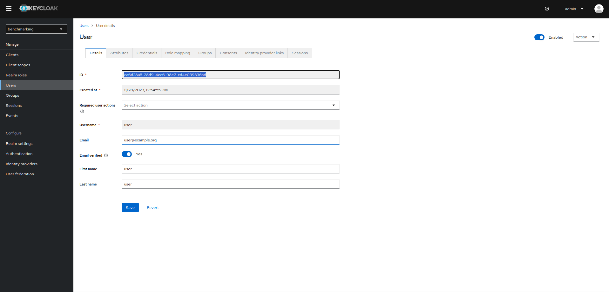

Then run the script:

```bash
go run ./cmd/add_user_to_group
```

#### Measuring the performance of fetching groups

To measure the performance of fetching groups, adjust the configurations in `cmd/measure_fetch_groups_time/main.go`:

```go
const (
    baseUrl     = "http://localhost:8080"
    realm       = "your_realm"
    accessToken = "your_access_token"
)
```

Then run the script:

- Note: This script iteratively creates and fetches groups for 2^0, 2^1, ..., 2^maxExponent. Be careful with the value of `maxExponent` as it can take a long time to run. E.g. if `maxExponent` is set to 20, the script will create and fetch groups for 2^0, 2^1, ..., 2^20, which results in 1048576 groups.

```bash
go run ./cmd/measure_fetch_groups_time <maxExponent>
```

##### Example Output with `maxExponent` set to 3

```bash
$ go run ./cmd/measure_fetch_groups_time 3
Creating 2 groups...
Created 2 groups.
Fetching 2 groups...
Iteration 1 - Number of Groups: 2, Fetch Time: 37.133817ms

Creating 4 groups...
Created 4 groups.
Fetching 4 groups...
Iteration 2 - Number of Groups: 4, Fetch Time: 6.098273ms

Creating 8 groups...
Created 8 groups.
Fetching 8 groups...
Iteration 3 - Number of Groups: 8, Fetch Time: 8.342701ms

+-----------+------------------+-------------+
| ITERATION | NUMBER OF GROUPS | FETCH TIME  |
+-----------+------------------+-------------+
|         1 |                2 | 37.133817ms |
|         2 |                4 | 6.098273ms  |
|         3 |                8 | 8.342701ms  |
+-----------+------------------+-------------+

```

Feel free to customise the configurations and adapt the scripts as needed for your testing environment.

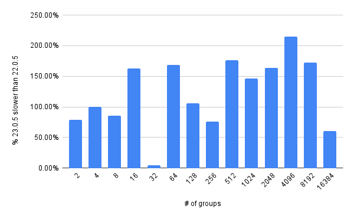
